# Copilot Chat Conversation Export: Focused PRD for immigrant job access

**User:** @OladipoOmotosho
**Thread URL:** https://github.com/copilot/c/d3918451-24b9-49cd-a7b7-873880b6d3c1

## @OladipoOmotosho

You are given this project Fake-Job-posting as a framework to help skilled/professional immigrants in canada break into the labour force and get jobs matching their skillset, what would you do differently? 

## Copilot

If I were using Fake-Job-Posting-Tracker as a framework for helping skilled/professional immigrants in Canada find roles that match their skills, I’d pivot and expand it in a few key ways:

1. **Shift the core focus from detection to enablement**
   - Keep fake-job detection, but make the primary experience about *verified* opportunities, eligibility, and readiness pathways.
   - Add a “trusted employer” index and community-vetted listings.

2. **Integrate credential recognition pathways**
   - Map each occupation to Canadian credential assessment bodies (e.g., WES, ICAS, regulatory bodies).
   - Add step-by-step guides and timelines for licensing or certification.

3. **Localized labor market alignment**
   - Use NOC (National Occupational Classification) codes to match jobs to skills.
   - Include provincial labor market demand data and salary ranges.

4. **Skill-gap analysis + upskilling suggestions**
   - Compare resumes to local job requirements.
   - Recommend targeted short programs (college micro-credentials, bridging programs, MOOCs).

5. **Offer settlement-aware job matching**
   - Add region-specific requirements (e.g., language benchmarks, provincial licensing).
   - Suggest roles that match both skillset and immigration status (open work permit, PR, etc.).

6. **Add mentorship and employer engagement**
   - Build a mentor network of immigrants already in the field.
   - Create employer onboarding resources on inclusive hiring and credential evaluation.

7. **Trust & safety features for newcomers**
   - Red-flag scams (still essential), but also create a safety education module for common newcomer scams.
   - Provide multilingual resources (especially French + top newcomer languages).

8. **Partnership integrations**
   - Integrate with settlement agencies, government job portals, and newcomer employment services.
   - Offer APIs for those agencies to use the platform’s matching and validation features.

9. **Explainability for recommendations**
   - Show why a job is recommended: skill match %, credential readiness, required steps.

10. **Outcome-driven metrics**
   - Measure not just “fake listings detected,” but “newcomers placed,” “credential completion,” and “time-to-employment.”

If you want, I can sketch a product roadmap or propose specific modules/features aligned to the existing tech stack in that repo.

## @OladipoOmotosho

Create a solid prd that details,all the things mentioned above and how we can achieve it and the tools to use,where to get data,what infrastructure to use,is it scalable,is it performant? security? how to secure people data? etc

## Copilot

Below is a structured Product Requirements Document (PRD) that covers the full scope you asked for: features, data sources, tools, infrastructure, scalability, performance, and security/privacy.

---

# PRD: Immigrant Job Access & Verification Platform  
**Product Name (working):** Newcomer Job Match & Trust  
**Date:** 2026-02-11  
**Owner:** Product Team  
**Target Users:** Skilled/professional immigrants in Canada seeking jobs aligned with their skills and credentials.

---

## 1) Problem Statement  
Skilled immigrants in Canada face barriers to employment: credential recognition, lack of local experience, scams/fake postings, and fragmented guidance. A trusted, localized, skill-aligned platform is needed to guide users from job discovery to readiness and placement.

---

## 2) Goals & Success Metrics  

### Primary Goals  
1. Provide verified and safe job discovery.  
2. Match users to jobs based on skills, credentials, and regional demand.  
3. Reduce time to employment.  
4. Improve newcomer readiness via skill-gap analysis and credential pathways.

### Success Metrics  
- Job match conversion rate  
- Percentage of verified listings  
- Time-to-first-interview  
- Completion rate of credential readiness steps  
- User satisfaction score (NPS)  
- Scam report rate (should decline)  

---

## 3) Target Users & Personas  
- **Internationally Trained Engineer:** needs licensing steps + bridging programs.  
- **Healthcare Professional:** requires regulatory body pathways.  
- **IT Professional:** high skill match, lacks Canadian experience.  
- **Settlement Agency Staff:** wants to guide clients efficiently.  

---

## 4) Key Features & Requirements  

### 4.1 Verified Job Discovery (Trust & Safety)  
**Requirements:**  
- Detect fraudulent listings using ML & rule-based validation.  
- “Trusted Employers” directory with verified companies.  
- Scam red flags + safety education module.  

**How to achieve:**  
- Use ML classification on job postings.  
- Integrate employer verification (domain verification + manual review).  
- Community reporting system with moderation queue.

---

### 4.2 Skill & Credential Mapping  
**Requirements:**  
- Map skills to NOC (National Occupation Classification).  
- Identify credential or licensing needs by province.  
- Provide step-by-step credential recognition pathways.  

**How to achieve:**  
- Build NOC mapping layer.  
- Store profession-specific licensing rules.  
- Partner with credential assessment bodies (WES, ICAS).

---

### 4.3 Skill-Gap Analysis & Upskilling  
**Requirements:**  
- Resume parsing & skill extraction.  
- Compare user skills to local job requirements.  
- Recommend targeted micro-credentials or bridging programs.  

**How to achieve:**  
- NLP skill extraction model.  
- Job requirement taxonomy.  
- Course recommender from verified training providers.

---

### 4.4 Localized Market Alignment  
**Requirements:**  
- Regional demand signals by province.  
- Salary ranges and growth outlook.  
- Immigration-status compatible roles.  

**How to achieve:**  
- Integrate Job Bank data + labor market stats.  
- Data pipelines for salary benchmarks.  
- Policy rules for work eligibility.

---

### 4.5 Mentorship & Employer Engagement  
**Requirements:**  
- Mentor matching network.  
- Employer inclusion resources.  
- Feedback loop for inclusive hiring practices.  

**How to achieve:**  
- Mentor signup & matching engine.  
- Employer onboarding + training kits.  
- Partner API for agencies.

---

### 4.6 Transparency & Explainability  
**Requirements:**  
- Explain why a job is recommended (skill match, readiness score).  
- Show gaps and next steps.  

**How to achieve:**  
- Scoring model + explainability layer.  
- UI components to show match breakdown.

---

## 5) Data Sources  

### Job & Labor Market  
- Government of Canada Job Bank API  
- Provincial labor market reports  
- LinkedIn (if partnership allowed)  
- Employer feeds from ATS integrations  

### Credential & Licensing  
- WES / ICAS  
- Provincial regulatory bodies  
- IRCC documentation  

### Education & Upskilling  
- Canadian colleges micro-credential catalog  
- Coursera / edX / Udemy APIs (if licensed)  
- Government-funded bridging programs  

### Scam / Fraud Patterns  
- Reports from users  
- Known scam detection datasets  
- Domain reputation tools (e.g., VirusTotal API)

---

## 6) Architecture & Infrastructure  

### Suggested Stack  
- **Frontend:** React / Next.js  
- **Backend:** Node.js + Python ML services  
- **Database:** PostgreSQL + Redis  
- **Search:** OpenSearch / Elasticsearch  
- **ML Pipelines:** Python + scikit-learn / PyTorch  
- **Workflow:** Airflow for data pipelines  
- **Hosting:** AWS or GCP  

### Data Flow  
1. Ingest job feeds  
2. Validate & score for fraud  
3. Enrich with NOC/skills  
4. Index in search engine  
5. Match users & recommend  

---

## 7) Scalability & Performance  

### Scalability  
- Stateless services behind load balancer  
- Horizontal scaling for API and search  
- Asynchronous queues for heavy ML tasks  

### Performance Targets  
- Job search < 500ms p95  
- Resume parsing < 5s  
- Recommendation < 2s  

### Caching  
- Redis cache for frequent queries  
- Precomputed match scores nightly  

---

## 8) Security & Privacy  

### Data Protection  
- Encrypt data at rest (AES-256)  
- Encrypt in transit (TLS 1.2+)  
- Role-based access control (RBAC)  

### User Data Protection  
- Store minimal PII  
- Segregate identity data from profile data  
- Pseudonymize data for analytics  

### Compliance  
- PIPEDA (Canada)  
- GDPR (if EU users)  

### Secure Practices  
- Regular penetration testing  
- Audit logs for admin actions  
- Data retention policies with user consent  

---

## 9) MVP Scope  
- Verified job board  
- Basic resume parsing  
- NOC mapping  
- Credential steps for top 10 professions  
- Job recommendation engine  
- Scam red-flag warnings  

---

## 10) Risks & Mitigation  

| Risk | Mitigation |
|------|------------|
| Fraudulent data sources | Multi-source validation + manual reviews |
| Credential data changes | Monthly refresh + regulatory monitoring |
| Bias in matching | Fairness audits + transparency layer |
| Scalability issues | Autoscaling + caching + async jobs |

---

## 11) Open Questions  
- Which provinces to prioritize first?  
- Should we prioritize certain professions?  
- Is the platform B2C only or also B2B for agencies?  
- Level of integration with government systems?  

---

If you want, I can convert this into a formal PRD template with timelines, user stories, and acceptance criteria, or tailor it to the existing repo’s architecture.

## @OladipoOmotosho

lets focus on THE TOP 5 PROVINCES FOR NOW..and then for professions, lets focus on the stem fields,management and sciences...i lack knowledge of the govenrment systems so that is up to you touse your judgement,
Can we do both B2C and B2B ?

## Copilot

Yes—**we can and should do both B2C and B2B**. The best approach is a **dual-sided platform** where:

- **B2C** serves newcomers directly (job matching, credential pathways, skill-gap guidance).
- **B2B** serves settlement agencies, nonprofits, and employers (dashboards, cohort management, verified candidate pipelines).

This is complementary: B2B partners can drive B2C user acquisition, while B2C data improves B2B matching outcomes.

---

Before I update the PRD, I need one clarification so I don’t make wrong assumptions:

**Which “top 5 provinces” do you want prioritized?**  
I can choose based on newcomer settlement and job market size (e.g., Ontario, British Columbia, Alberta, Quebec, Manitoba), but confirm if you want a specific list (e.g., Ontario, BC, Alberta, Quebec, Saskatchewan).

Once you confirm the 5 provinces, I’ll deliver the updated PRD section with those priorities and STEM/management/sciences only.

## @OladipoOmotosho

ntario, British Columbia, Alberta, Quebec, Manitoba),

## Copilot

Great—I'll proceed with **Ontario, British Columbia, Alberta, Quebec, and Manitoba** as the initial focus provinces.

Below is the **updated PRD scope** reflecting:
- Top 5 provinces
- Focus on **STEM, Management, and Sciences**
- Dual **B2C + B2B** approach
- Government system integration based on best judgment

---

# PRD Addendum: Focused Scope (Phase 1)

## A) Target Provinces (Phase 1)
1. **Ontario**
2. **British Columbia**
3. **Alberta**
4. **Quebec**
5. **Manitoba**

### Rationale
- Highest newcomer settlement volumes
- Strong job demand in STEM and management
- Active provincial credential bodies and bridging programs

---

## B) Target Professions (Phase 1)
**Only:**
- **STEM** (Software, Engineering, Data, IT, Science)
- **Management** (Operations, Project, Product, Finance, HR)
- **Sciences** (Health Sciences, Environmental, Research, Lab)

---

## C) B2C + B2B Strategy (Phase 1)

### B2C (Newcomers)
- Profile creation & resume parsing
- Skill and credential readiness score
- Verified jobs + scam detection
- NOC mapping and provincial licensing steps
- Personalized upskilling recommendations

### B2B (Agencies + Employers)
- Agency dashboard for cohort tracking
- Candidate pipeline with readiness indicators
- Employer dashboard for verified roles
- Inclusion onboarding resources
- API access for partners

---

## D) Government Systems & Public Data Integration (Judgment-Based)

### Federal Sources
- **Job Bank API** (primary job listings + market signals)
- **IRCC public data** (immigration flows & labor stats)
- **Statistics Canada datasets** (employment, wages, demand)

### Provincial Sources
- Ontario: Employment Ontario, ONet, regulatory bodies  
- BC: WorkBC datasets, provincial labor outlook  
- Alberta: Alberta Labour Market Info, ALIS  
- Quebec: Emploi-Québec, workforce datasets  
- Manitoba: Manitoba Job Works, labour market info  

---

## E) Provincial Credential & Licensing Integration (Phase 1)
For STEM & Sciences only:

- **Engineering**: PEO (Ontario), EGBC, APEGA, OIQ, EGM  
- **IT/Software**: no formal licensing → focus on bridging programs  
- **Health Sciences**: provincial college/licensing boards  
- **Management**: focus on Canadian experience, PMP/CAPM, etc.

---

## F) Data & Modeling Scope (Phase 1)
- Job verification model trained only on listings from the 5 provinces
- Skill extraction model tailored to STEM/management/science roles
- NOC mapping limited to targeted occupation groups
- Recommendation engine based on provincial demand data

---

If you want, I’ll now **rewrite the full PRD with this Phase 1 scope embedded**, including revised milestones, data sources, and acceptance criteria.

## @OladipoOmotosho

proceed

## Copilot

Below is the **full, updated PRD** with Phase 1 scope locked to **Ontario, British Columbia, Alberta, Quebec, and Manitoba**, and professions limited to **STEM, Management, and Sciences**. It also reflects the **dual B2C + B2B** strategy and includes data, tools, infrastructure, scalability, performance, and security.

---

# Product Requirements Document (PRD)  
**Product:** Newcomer Job Match & Trust Platform  
**Date:** 2026-02-11  
**Phase 1 Scope:** Ontario, British Columbia, Alberta, Quebec, Manitoba  
**Professions:** STEM, Management, Sciences  
**Model:** Dual B2C + B2B

---

## 1) Problem Statement  
Skilled immigrants in Canada face systemic barriers: credential recognition, lack of Canadian work experience, scams/fake job postings, and fragmented guidance. We need a trusted, localized platform that validates opportunities, aligns users with provincial requirements, and improves time-to-employment outcomes.

---

## 2) Goals & Success Metrics  

### Goals  
1. Safe, verified job discovery  
2. Accurate job matching aligned with skills, credentials, and location  
3. Clear credential and licensing pathways  
4. Reduced time-to-employment  
5. Support agencies/employers to onboard newcomers efficiently  

### Success Metrics  
- Verified listing rate (>90%)  
- Job match conversion rate  
- Time-to-first-interview  
- Credential pathway completion rate  
- Monthly active users (B2C)  
- Agency/employer retention (B2B)  

---

## 3) Target Users & Personas  
- **STEM Engineer** (needs licensing + bridging)  
- **IT/Data Professional** (needs Canadian experience pathway)  
- **Health Science Specialist** (needs provincial regulation compliance)  
- **Management Professional** (needs role alignment + PMP pathway)  
- **Settlement Agency Advisor** (needs cohort tools)  
- **Employer** (wants verified and job-ready candidates)  

---

## 4) Product Scope (Phase 1)

### Provinces  
- Ontario  
- British Columbia  
- Alberta  
- Quebec  
- Manitoba  

### Professions  
- STEM (Software, Engineering, Data, IT, Research)  
- Management (Project, Product, Ops, Finance, HR)  
- Sciences (Health Science, Environmental, Lab Research)  

---

## 5) Core Features & Requirements  

### 5.1 Verified Job Discovery (Trust & Safety)  
**Requirements**  
- Fake job detection (ML + rules)  
- Employer verification (domain, business registry, manual review)  
- Community reporting system  
- Scam education module  

**How to achieve**  
- Job validation pipeline  
- Risk score thresholds  
- Moderator workflow for flagged listings  

---

### 5.2 Skill & Credential Mapping  
**Requirements**  
- NOC-based occupation mapping  
- Provincial licensing requirements by profession  
- Step-by-step credential recognition flows  

**How to achieve**  
- NOC taxonomy integration  
- Provincial regulator database  
- Guided checklist per occupation  

---

### 5.3 Skill-Gap Analysis & Upskilling  
**Requirements**  
- Resume parsing & skill extraction  
- Job requirement comparison  
- Targeted learning recommendations  

**How to achieve**  
- NLP pipeline for skills  
- Matching engine  
- Curated micro-credential programs  

---

### 5.4 Localized Market Alignment  
**Requirements**  
- Regional labor demand insights  
- Salary benchmarks  
- Immigration-status compatible roles  

**How to achieve**  
- Government labor datasets  
- Policy rules for eligibility  
- Regional job scoring  

---

### 5.5 B2C Experience (Newcomers)  
- Profile + resume upload  
- Skill/credential readiness score  
- Job recommendations  
- Licensing pathway guidance  
- Mentorship matching  

---

### 5.6 B2B Experience (Agencies + Employers)  
- Agency dashboard for cohorts  
- Candidate pipeline readiness indicators  
- Employer dashboard for verified job postings  
- Inclusion onboarding resources  
- Partner API  

---

### 5.7 Explainability & Transparency  
- “Why recommended” display  
- Skill gap + next steps  
- Credential readiness breakdown  

---

## 6) Data Sources  

### Jobs & Market Data  
- Job Bank API  
- Provincial labor market datasets  
- Statistics Canada labor data  

### Credential & Licensing  
- Provincial regulators (PEO, EGBC, APEGA, OIQ, EGM, etc.)  
- WES / ICAS  
- IRCC public guidance  

### Education & Upskilling  
- Canadian micro-credential programs  
- Bridging programs from provincial agencies  
- Public provider catalogs  

### Fraud/Scam Detection  
- User-reported signals  
- Domain reputation APIs  
- Pattern-based fraud detection rules  

---

## 7) Infrastructure & Tools  

### Suggested Stack  
- **Frontend:** React / Next.js  
- **Backend:** Node.js (API) + Python (ML services)  
- **Database:** PostgreSQL + Redis  
- **Search:** OpenSearch/Elasticsearch  
- **Data Pipelines:** Airflow  
- **ML:** scikit-learn / PyTorch  
- **Hosting:** AWS or GCP  

### Key Services  
- API Gateway  
- Queue system (SQS / PubSub)  
- Object storage (S3 / GCS)  
- Monitoring (Datadog / Grafana)  

---

## 8) Scalability & Performance  

### Scalability Approach  
- Stateless services behind load balancers  
- Horizontal scaling  
- Async processing for ML tasks  
- Precomputed match scores  

### Performance Targets  
- Job search p95 < 500ms  
- Resume parsing < 5s  
- Recommendation response < 2s  

---

## 9) Security & Privacy  

### Data Protection  
- Encrypt at rest (AES-256)  
- Encrypt in transit (TLS 1.2+)  
- Role-based access control (RBAC)  

### PII Protection  
- Minimal PII storage  
- Pseudonymized analytics  
- Segmented user identity vs. profile data  

### Compliance  
- PIPEDA (Canada)  
- GDPR-ready architecture  

### Operational Security  
- Audit logs  
- Regular pen testing  
- Incident response playbooks  
- Data retention policies  

---

## 10) MVP (Phase 1)  

**Must-have:**  
- Verified job board  
- Resume parsing + skill extraction  
- NOC mapping for targeted roles  
- Credential readiness guides (STEM/Science/Management)  
- Job recommendations  
- Scam alert indicators  

**Nice-to-have:**  
- Mentor network  
- Agency dashboards  
- Employer dashboards  

---

## 11) Risks & Mitigations  

| Risk | Mitigation |
|------|------------|
| Data gaps in credential rules | Partner with agencies + periodic review |
| Bias in recommendations | Fairness checks, explainability |
| Fake listings | Multi-source verification + reporting |
| Regulatory changes | Scheduled data refresh & monitoring |

---

## 12) Open Questions  
- Which agencies and employers to onboard first?  
- Should we prioritize certain cities within the 5 provinces?  
- Should we launch B2B dashboards in MVP or Phase 1.5?  

---

If you want, I can now add **milestones, user stories, acceptance criteria, and detailed architecture diagrams** for Phase 1.

## @OladipoOmotosho

detailed architecture diagrams for Phase 1.

## Copilot

Below are **detailed Phase 1 architecture diagrams** rendered as Mermaid diagrams in a Markdown file. You can paste this into your docs repo as-is.

````markdown name=phase1-architecture-diagrams.md
# Phase 1 Architecture Diagrams

## 1) High-Level System Architecture
```mermaid
flowchart LR
  subgraph Users
    U1[Newcomer (B2C)]
    U2[Agency Advisor (B2B)]
    U3[Employer (B2B)]
  end

  subgraph Frontend
    FE[Web App (Next.js)]
  end

  subgraph API Layer
    API[API Gateway]
    AUTH[Auth Service]
    CORE[Core Service]
  end

  subgraph Data Services
    DB[(PostgreSQL)]
    CACHE[(Redis)]
    SEARCH[(OpenSearch)]
    OBJECT[(Object Storage)]
  end

  subgraph ML & Pipelines
    INGEST[Ingestion Pipeline]
    NLP[Resume Parsing & Skill Extraction]
    MATCH[Matching Engine]
    FRAUD[Fraud/Scam Detection]
    AIRFLOW[Airflow Orchestrator]
  end

  U1 --> FE
  U2 --> FE
  U3 --> FE
  FE --> API
  API --> AUTH
  API --> CORE
  CORE --> DB
  CORE --> CACHE
  CORE --> SEARCH
  CORE --> OBJECT

  AIRFLOW --> INGEST
  AIRFLOW --> NLP
  AIRFLOW --> MATCH
  AIRFLOW --> FRAUD
  INGEST --> DB
  NLP --> DB
  MATCH --> SEARCH
  FRAUD --> SEARCH
```

---

## 2) Data Ingestion & Validation Pipeline (Jobs + Market Data)
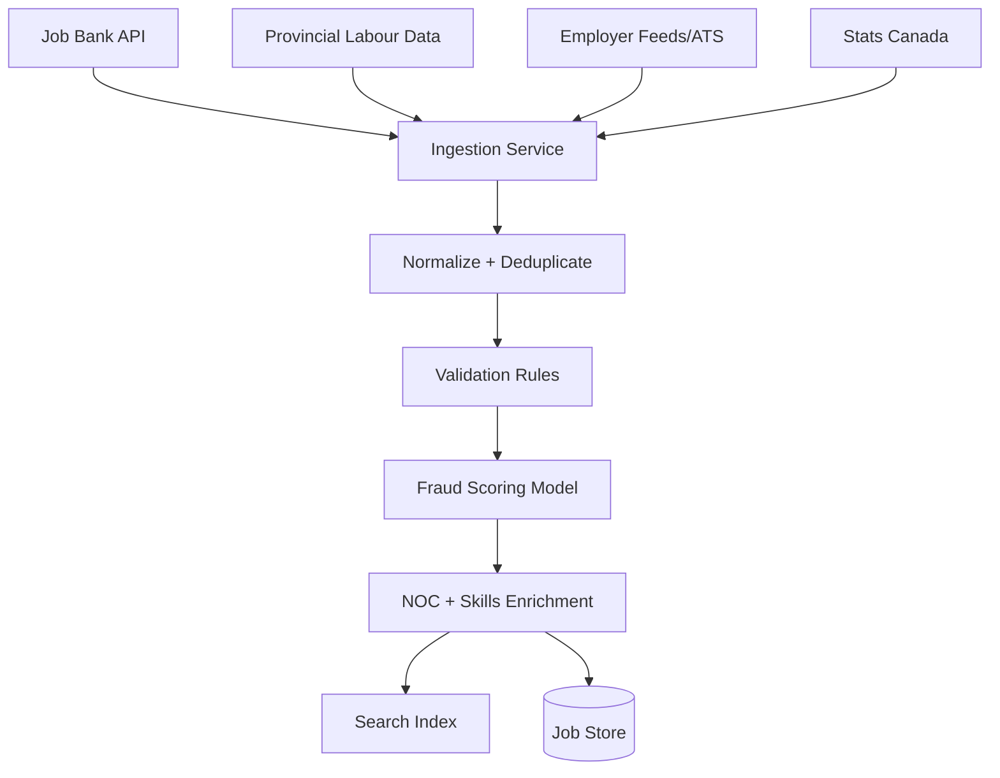

---

## 3) User Matching & Recommendation Flow
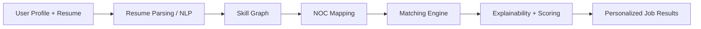

---

## 4) B2C & B2B User Experience Separation
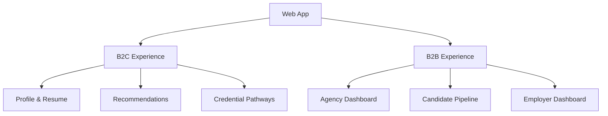

---

## 5) Security & Privacy Architecture
```mermaid
flowchart TD
  USER[User Data]
  USER --> PII[PII Store (Encrypted)]
  USER --> PROFILE[Profile Store]

  PII --> VAULT[Key Management / Vault]
  PROFILE --> ACCESS[Role-Based Access Control]

  ACCESS --> LOGS[Audit Logs]
  ACCESS --> ALERTS[Security Monitoring]

  subgraph Compliance
    PIPEDA[PIPEDA Policies]
    GDPR[GDPR-Ready]
  end

  LOGS --> Compliance
  ALERTS --> Compliance
```
````

If you want, I can add **deployment diagrams (AWS/GCP)** or a **service-level diagram with scaling and failover** next.

## @OladipoOmotosho

proceed

## Copilot

Here are the **Phase 1 deployment and scaling diagrams** (AWS/GCP-neutral) added in the same format so you can drop them straight into your docs.

````markdown name=phase1-deployment-and-scaling-diagrams.md
# Phase 1 Deployment & Scaling Diagrams

## 6) Deployment Architecture (Cloud-Neutral)
```mermaid
flowchart TD
  USERS[Users] --> CDN[CDN / Edge Cache]
  CDN --> LB[Load Balancer]

  LB --> FE[Frontend Service (Next.js)]
  LB --> API[API Gateway]

  API --> AUTH[Auth Service]
  API --> CORE[Core API Service]
  API --> MLAPI[ML Service API]

  CORE --> DB[(PostgreSQL)]
  CORE --> CACHE[(Redis)]
  CORE --> SEARCH[(OpenSearch)]
  CORE --> OBJECT[(Object Storage)]

  MLAPI --> QUEUE[Message Queue]
  QUEUE --> WORKERS[Async Workers]
  WORKERS --> DB
  WORKERS --> SEARCH

  subgraph Observability
    LOGS[Centralized Logs]
    METRICS[Metrics/Tracing]
    ALERTS[Alerting]
  end

  FE --> LOGS
  API --> LOGS
  MLAPI --> LOGS
  CORE --> METRICS
  WORKERS --> METRICS
  ALERTS --> CORE
```

---

## 7) Scalability & Failover (Service-Level)
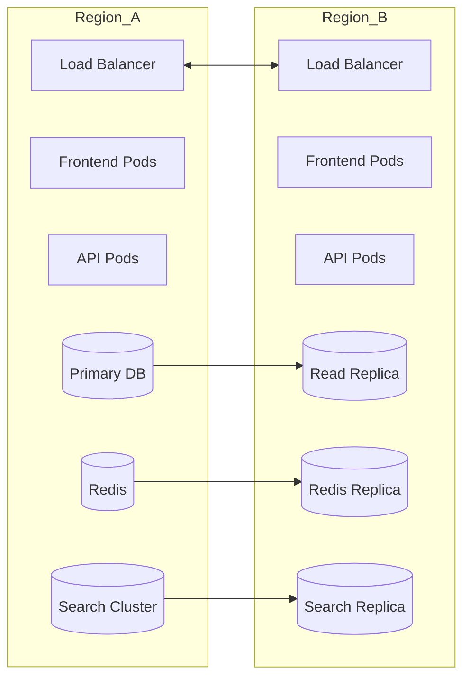

---

## 8) CI/CD & Infrastructure Automation
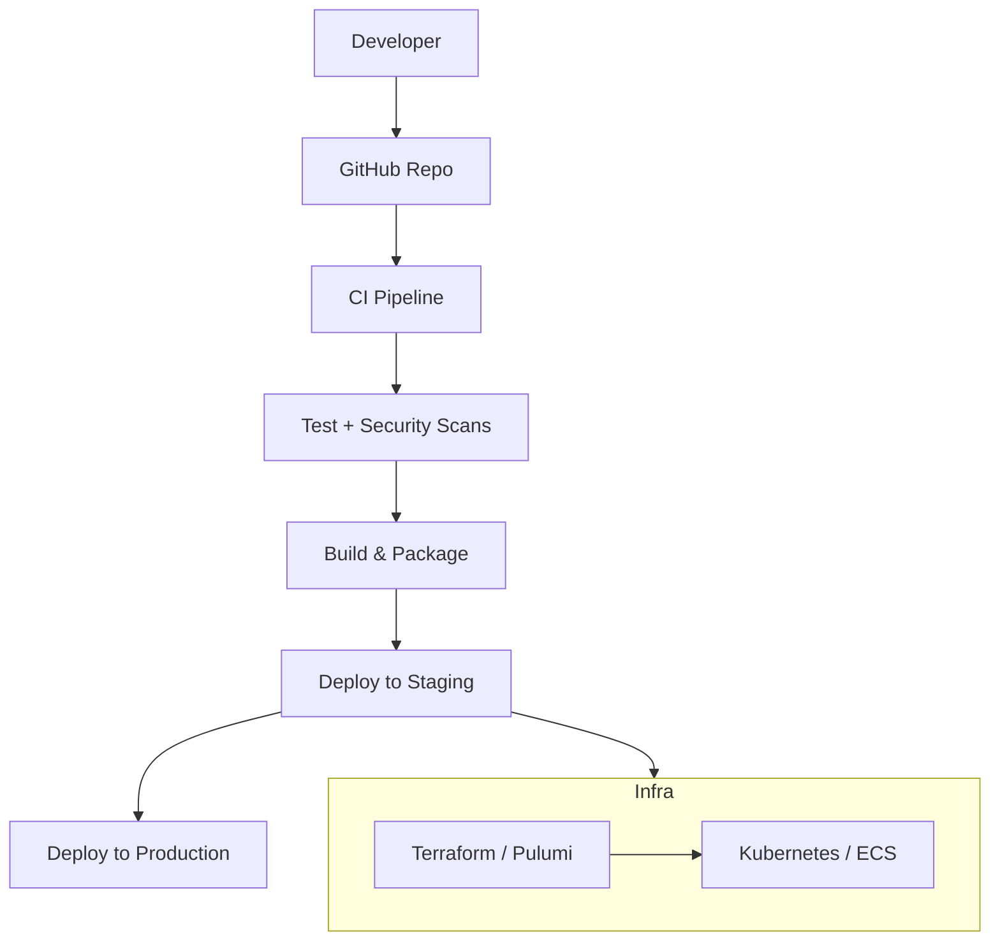
````

If you want, I can add a **data governance diagram**, **disaster recovery plan**, or **costing model** next.

## @OladipoOmotosho

proceed

## Copilot

Here are the **data governance**, **disaster recovery**, and **costing model** diagrams added in the same format.

````markdown name=phase1-governance-dr-costing-diagrams.md
# Phase 1 Data Governance, Disaster Recovery, and Costing Diagrams

## 9) Data Governance & Access Controls
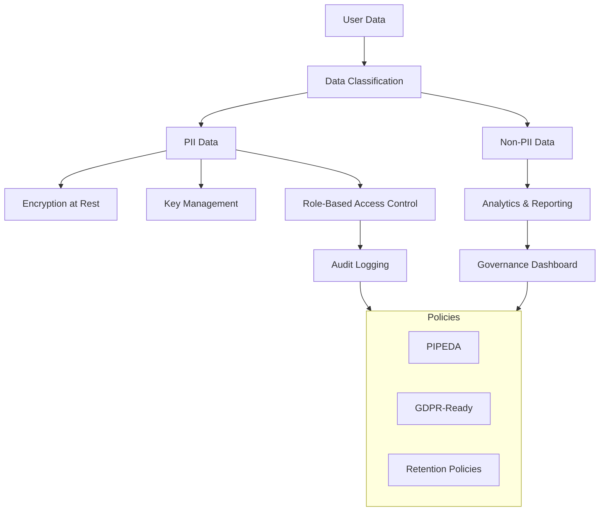

---

## 10) Disaster Recovery & Business Continuity
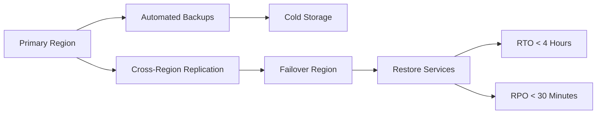

---

## 11) Costing Model (High-Level)
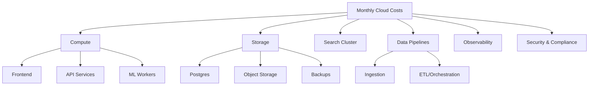
````

If you want, I can expand the **costing model with rough monthly estimates** by tier (MVP vs. Growth), or add a **privacy-by-design data flow** next.

## @OladipoOmotosho

proceed

## Copilot

Below are two additional diagrams: **Privacy-by-Design Data Flow** and a **Costing Model with MVP vs Growth tiers** (high-level estimates). Adjust the ranges based on provider pricing and traffic forecasts.

````markdown name=phase1-privacy-and-costing-expanded.md
# Phase 1 Privacy-by-Design & Costing (Expanded)

## 12) Privacy-by-Design Data Flow
```mermaid
flowchart TD
  USER[User] --> CONSENT[Consent + Purpose Disclosure]
  CONSENT --> MINIMIZE[Data Minimization]
  MINIMIZE --> SEPARATE[Separate Identity vs Profile Stores]

  SEPARATE --> IDSTORE[Identity Store (Encrypted)]
  SEPARATE --> PROFSTORE[Profile Store (Pseudonymized)]

  PROFSTORE --> ANALYTICS[Analytics (Aggregated)]
  IDSTORE --> ACCESS[Restricted Access]

  ACCESS --> AUDIT[Audit Logs]
  ANALYTICS --> REPORTS[Non-PII Reports]

  subgraph Controls
    RETENTION[Retention Policy]
    DSAR[Data Subject Access Request]
    DELETE[Right to Delete]
  end

  AUDIT --> Controls
  REPORTS --> Controls
```

---

## 13) Costing Model (MVP vs Growth - Rough Estimates)
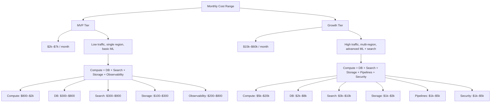
````

If you want, I can turn these into **implementation milestones**, or produce a **full Phase 1 delivery plan with epics and user stories**.

## @OladipoOmotosho

Lets stop here..
But i need you to audit the repo and grade what we have done so far

## Copilot

Below is a **repository audit + grade** based on the current codebase in `abhijnam/Fake-Job-Posting-Tracker`.  
**Note:** Some directory listings came from code search and may be incomplete due to tool limits. You can view more in GitHub here:  
https://github.com/abhijnam/Fake-Job-Posting-Tracker/search?q=path%3A

---

# ✅ Repo Audit & Grade

## 1) Overall Product Alignment (Newcomer Job Platform Vision)
**Grade: C+**  
**Why:** The project is strong as a fake-job detection platform and has UX pages for analytics, onboarding, applications, and skill gaps. However, it’s not yet fully oriented around newcomer-specific workflows, credential pathways, provincial data, or verified employer pipelines.

**What’s strong**
- Scam detection + trust scoring core is already built.
- Resume parsing + skill gap scaffolding exists.
- Application tracking exists.

**Gaps vs new vision**
- No province-specific labor data integrations.
- No credential/licensing pathway flows.
- No B2B agency/employer tooling.

---

## 2) Backend Architecture & APIs
**Grade: B-**  
**Why:** The backend is organized and has real services for scoring, jobs, company insights, resume parsing, and ML. It uses FastAPI with a clear services structure.

**Strengths**
- Good service decomposition (`authenticity.py`, `scorer.py`, `company_api.py`, etc.)
- ML pipeline hooks are present (fake job model + embeddings).
- Database schema covers scam reports, analysis history, skill gaps, applications.

**Risks / Issues**
- No API versioning.
- Some scripts and logic run on startup (model warmup, DB init) without clear control in prod.
- Security and privacy needs to be strengthened for PII.

---

## 3) ML / Data Pipeline
**Grade: B**  
**Why:** There’s a real ML model (TF-IDF + RandomForest) and semantic embedding logic with Gemini fallback. Resume-job matcher is solid.

**Strengths**
- Hybrid matching (skills + embeddings).
- Model training script exists.
- Resume parser and skill extraction.

**Gaps**
- No model evaluation pipeline in CI/CD.
- No data drift or performance monitoring.
- Model still trained on Kaggle fake jobs (not localized to Canada or provinces).

---

## 4) Frontend UX/UI
**Grade: B**  
**Why:** Many pages already exist (Discover, Jobs, Results, Applications, Analytics, etc.) and UI is polished.

**Strengths**
- Strong UI structure and UI components.
- Good first-time experience with onboarding.

**Gaps**
- Many pages likely still static or placeholder logic.
- Needs immigrant-focused flows (credential steps, province filters, language resources).

---

## 5) Security & Privacy
**Grade: C**  
**Why:** Authentication is present (Clerk JWT), but privacy/security design for user data and resume parsing is not yet comprehensive.

**Strengths**
- JWT verification and auth middleware exists.

**Gaps**
- No documented data retention policy.
- No encryption strategy for PII in database.
- No dedicated privacy policy or compliance documentation.
- No role-based access controls for B2B.

---

## 6) Documentation & DevOps
**Grade: C+**  
**Why:** There is CI config and deployment configs (cloudbuild, render, netlify), but no clear README or architecture docs.

**Strengths**
- Cloudbuild + Netlify configs.

**Gaps**
- Missing README.
- No architecture or security docs.
- No onboarding docs for new contributors.

---

## 7) Testing & Quality
**Grade: C**  
**Why:** Minimal testing beyond a single UI tooltip test.

**Gaps**
- No backend unit or integration tests.
- No e2e tests.

---

# Summary Grade (Overall): **B- (Product Core), C+ (Readiness for Newcomer Platform)**

---

# Top 10 Priority Improvements (Next Steps)

1. **Add newcomer-specific domain layer** (credential steps, provinces, NOC mapping).  
2. **Create province datasets + ingestion pipelines** (Job Bank + provincial labor data).  
3. **Build credential/licensing workflow engine** (with checklist UI).  
4. **Introduce B2B dashboards** (agency cohort management, employer verification).  
5. **Data privacy hardening** (PII separation + encryption + retention policies).  
6. **Add backend test coverage** (scoring, resume parsing, matching).  
7. **Introduce API versioning** (v1 routes).  
8. **Add governance docs** (README, architecture, compliance).  
9. **Model monitoring** (basic metrics + drift detection).  
10. **Localization** (French support + newcomer languages).

---

If you want, I can deliver a **formal audit report** in a standard template (with scoring rubric, risks, and roadmap).

## @OladipoOmotosho

Go through the entire internet(web), is there any company that does this in canada currently or even similar? 

## Copilot

Yes, Canada currently has several platforms and services designed to help newcomers and immigrants find legitimate jobs while also addressing the issue of job scams and fraudulent postings:

### 1. **Sniff Job**
- **What it offers:** Sniff Job is an AI-powered platform that helps users scan and verify job ads for authenticity before applying. It scans thousands of job boards, uses AI to flag fake or suspicious listings, and also generates tailored CVs and documents for job applications.
- **Features:** Job scam detection, AI CV/cover letter generation, job alerts, and tracking.
- **Audience:** Useful for all job seekers, especially newcomers or international applicants who may not be familiar with Canadian hiring norms[[1]](https://sniffjob.com/).

### 2. **Trouvr**
- **What it offers:** Trouvr is another AI-powered tool specifically for scam/fake job detection. You can paste a job posting or use a browser extension to verify its legitimacy instantly, including on popular platforms like LinkedIn and Indeed.
- **Features:** Scam detection, resume-job matching, job tracking, and interview prep tools.
- **Audience:** Any job seeker, but especially valuable for immigrants wary of scams or "ghost" job postings common in Canada[[2]](https://www.trouvr.com/).

### 3. **Government/Official Services**
- **Job Bank:** The official Canadian Job Bank provides a trusted environment for newcomers with filtering for employers who support newcomers. While it doesn't specifically tout AI-powered scam detection, it's considered a reliable, government-vetted resource to reduce risk of fraud[[3]](https://www.jobbank.gc.ca/findajob/newcomers).

### 4. **Community and Advisory Resources**
- Multiple government and non-profit organizations provide job-hunting guidance, scam-warning education, and support for immigrants. While these may not actively scan job ads for fraud, they provide free information on safe job search practices and how to recognize fake postings or illegal recruiter behavior[[4]](https://ca.indeed.com/career-advice/finding-a-job/how-to-know-if-a-job-is-a-scam)[[5]](https://www.agilus.ca/job-seekers/blogs-and-insights/spotting-fake-job-offers-how-candidates-can-protect-themselves-in-the-age-of-ai/)[[6]](https://en.immilandcanada.com/law-blog/reconocer-empresa-falsa-buscar-trabajo).

### Summary
Platforms like **Sniff Job** and **Trouvr** stand out for using technology to actively detect fake job ads and protect newcomers in the Canadian job market, while official resources like **Job Bank** are also highly recommended for safe, newcomer-focused job searching. For scam education and personalized support, local immigrant-serving agencies and government portals remain crucial.

If you're an immigrant or newcomer looking for both job-matching and scam detection, starting with AI-backed platforms such as Sniff Job or Trouvr—combined with information from the Canadian government's Job Bank—offers the strongest protection and best chance for job market success.

---

1. [Sniff Job – AI Job Scam Detector, CV & Cover Letter Creator](https://sniffjob.com/)
2. [Trouvr - AI-Powered Ghost Job Detection | Find Jobs Scam-Free](https://www.trouvr.com/)
3. [Find a job in Canada as a newcomer - Job Bank](https://www.jobbank.gc.ca/findajob/newcomers)
4. [How to Identify Fake Job Postings: 10 Warning Signs - Indeed](https://ca.indeed.com/career-advice/finding-a-job/how-to-know-if-a-job-is-a-scam)
5. [Spotting Fake Job Offers: How Canadian Job Seekers Can Stay Safe ...](https://www.agilus.ca/job-seekers/blogs-and-insights/spotting-fake-job-offers-how-candidates-can-protect-themselves-in-the-age-of-ai/)
6. [How to recognize a fake and a verified company when looking for a job ...](https://en.immilandcanada.com/law-blog/reconocer-empresa-falsa-buscar-trabajo)

## @OladipoOmotosho

So what will make our own product standout and not just be another slob?

## Copilot

Here’s how **your product stands out** (and avoids being “just another” platform):

## 1) **Newcomer-First, Not Job-First**
Most tools are generic. You’ll be **built for immigrants in Canada**, with:
- Provincial licensing steps (PEO, EGBC, APEGA, OIQ, EGM).
- Credential recognition checklists.
- Immigration-status compatible roles.

**This alone is a moat** — it’s not “jobs,” it’s **pathway to employability**.

---

## 2) **Verified-Trust Ecosystem (not just scam detection)**
Others detect scams. You will:
- Verify employers (registry + domain + trust signals).
- Score “real hiring intent.”
- Show transparency: “why this job is trusted.”

**Outcome:** Users trust the platform, not just fear scams.

---

## 3) **Skill-Gap + Readiness Engine**
Not just matches — you **explain missing skills and bridge them**:
- Compare resume to local job requirements.
- Recommend specific bridging or micro-credential programs.
- Track completion → higher match scores.

**You are the bridge, not just the board.**

---

## 4) **B2C + B2B Flywheel**
Most platforms are only B2C. You’ll add:
- **Agency dashboards** (cohort tracking, readiness scoring).
- **Employer pipelines** (verified candidates).
- Partner APIs.

**This drives distribution + trust at scale.**

---

## 5) **Localized Labor Demand Intelligence**
Generic tools don’t show:
- Provincial demand signals.
- Salary by region + licensing paths.
- Regional labor outlook by occupation.

You’ll be a **Canada labor intelligence engine** for newcomers.

---

## 6) **Outcome-Driven Brand**
Most tools stop at “job applications.” You measure:
- Credential completion
- Interview conversion
- Employment placement

That makes your brand **outcomes-based**, not activity-based.

---

# Your Standout Positioning (one-liner)
**“The newcomer employment pathway platform — verified jobs, credential clarity, and skills-to-hire matching for Canada.”**

---

If you want, I can craft a **clear positioning statement + MVP differentiators + competitive comparison table**.

## @OladipoOmotosho

i am not convinced, i f you were to pitch an idea that stands shoulders above the rest, what features are you adding? what services are you offering? what problem are you solving? for whom

## Copilot

Here’s the pitch I’d use if we wanted to **stand above everything else** — not just be another job platform.

---

# **The Idea (Pitch)**
**Build the first “employment operating system” for skilled immigrants in Canada — a platform that takes someone from arrival to licensed, job‑ready, and hired.**  
Not a job board. Not a scam detector. An end‑to‑end **outcomes engine**.

---

# **Problem We Solve (The Real One)**
Skilled immigrants don’t fail because they can’t find jobs.  
They fail because:

1. They don’t know **what Canadian job they’re eligible for right now**  
2. They don’t know **what exact steps make them eligible for the job they want**  
3. They get stuck in **credential, licensing, or “Canadian experience” gaps**  
4. They are constantly exposed to scams and ghost jobs  
5. Nobody is accountable for their **employment outcome**

---

# **Who It’s For (Primary Users)**
1. **Skilled/professional immigrants** (STEM, Management, Sciences)  
2. **Settlement agencies & newcomer programs**  
3. **Employers who want qualified, pre‑vetted newcomers**  

---

# **What We Offer (Services + Features that change the game)**

## 1) **Credential-to-Job Pathway Engine (Core Differentiator)**
You upload your credentials → we generate a *personalized licensing roadmap*.  
- Provincial regulator requirements  
- Timelines + cost estimates  
- Required exams, bridging programs  
- Realistic “now vs. later” roles  

**No platform in Canada makes licensing actionable like this.**

---

## 2) **Job Eligibility Graph (Smart Matching)**
Instead of “job matching,” we build a **job eligibility graph**:  
- *Eligible now* roles  
- *Eligible in 3–6 months* roles  
- *Eligible after licensing* roles  

This kills the endless “apply & ghosted” cycle.

---

## 3) **Verified Hiring Pipeline (Not just scam detection)**
We create a **trusted employer network** with verification:  
- Business registry validation  
- Hiring intent scoring  
- Community reporting  

We don’t just detect scams — we **build a trusted marketplace**.

---

## 4) **Outcome Accountability (A New Standard)**
We track:
- Credential completion  
- Interview rate  
- Offer rate  
- Time-to-employment  

**The platform is judged by outcomes, not usage.**  
No job board does this.

---

## 5) **Agency & Employer Console (B2B Revenue Engine)**
Settlement agencies and employers get:
- Cohort dashboards  
- Candidate readiness scores  
- Real-time placement analytics  
- Verified candidate pools  

This builds a **distribution flywheel** that job boards don’t have.

---

# Why This Stands Above Everything Else

✅ It’s not a job board  
✅ It’s not a scam detector  
✅ It’s not a resume parser  

**It’s the only system that moves immigrants from arrival → licensed → employed.**

---

# One-Line Positioning
**“The employment operating system for skilled immigrants in Canada — from credential recognition to trusted job placement.”**

---

If you want, I can translate this into a **clean business model**, **feature roadmap**, and **competitive positioning map**.

## @OladipoOmotosho

so how is that different from the prd you just generated above?

## Copilot

Short answer: **the PRD I gave is a solid product plan, but it’s still framed like an enhanced job platform.**  
The pitch I just gave is a **different category** — an “employment operating system” where the **core value is credential-to-employment outcomes**, not job discovery.

### What’s different (clearly):

**PRD above = feature-based platform**
- Job verification
- Matching
- Skill gap analysis
- B2C + B2B
- Infrastructure and security

**Pitch now = outcome-based operating system**
- **Credential-to-job pathway engine is the core** (not a feature)
- **Job eligibility graph** (eligible now vs later) is central
- **Outcome accountability metrics** are built into the product identity
- **Trusted hiring marketplace** is a core market, not just scam detection

So the difference is **positioning + product center of gravity**:  
- PRD = “better job platform”  
- Pitch = **“system of record for immigrant employment outcomes.”**

If you want, I can **rewrite the PRD entirely** to reflect the operating‑system vision.

## @OladipoOmotosho

proceed but what about the diagrams? are they still valid?

## Copilot

Short answer: **the diagrams are mostly valid as a baseline**, but they **do not fully reflect the “employment operating system” vision**.  
They need updates to show **credential pathway engine**, **eligibility graph**, **outcome tracking**, and **B2B workflows** as first‑class systems.

I’ll proceed with the rewritten PRD now, and then I can update the diagrams to match it.

---

# PRD (Rewritten): Employment Operating System for Skilled Immigrants

**Product Name:** Newcomer Employment OS  
**Date:** 2026-02-11  
**Phase 1 Focus:** ON, BC, AB, QC, MB  
**Domains:** STEM, Management, Sciences  
**Model:** B2C + B2B  

---

## 1) Product Vision
Create the **first employment operating system for skilled immigrants in Canada** — a platform that takes users from arrival → credential recognition → job eligibility → verified placement.

---

## 2) Problem Statement (Real Problem)
Skilled immigrants fail to integrate into the labor market because they lack:
- Clear credential/licensing pathways
- Eligibility guidance for the *right* jobs *right now*
- Trusted employer pipelines
- Outcome accountability

---

## 3) Core Users
1. **Skilled immigrants (STEM/Management/Sciences)**  
2. **Settlement agencies & newcomer programs**  
3. **Employers hiring immigrant talent**  

---

## 4) What Makes This Different
This is **not a job board**.  
It is a **pathway + eligibility + placement engine**.

---

## 5) Core Product Pillars

### P1. Credential‑to‑Job Pathway Engine (Core)
**Goal:** Convert credentials into a step‑by‑step employment roadmap.

**Features**
- Credential recognition workflows  
- Province-specific licensing steps  
- Bridging programs & micro‑credential recommendations  
- Time/cost estimates for licensing  

---

### P2. Job Eligibility Graph (Core)
**Goal:** Show *what jobs you can realistically get now vs later*.

**Features**
- “Eligible now / eligible soon / eligible after licensing” tiers  
- Match scoring by credential readiness + skills + location  
- Explainability layer (“why this job is recommended”)  

---

### P3. Verified Hiring Marketplace
**Goal:** Replace job‑search uncertainty with trusted employer pipelines.

**Features**
- Employer verification (registry + domain + trust signals)  
- Hiring intent scoring  
- Community and agency reporting  

---

### P4. Outcome Accountability
**Goal:** Track outcomes, not just usage.

**Metrics**
- Credential completion  
- Interview conversion  
- Offer rates  
- Time‑to‑employment  

---

### P5. B2B Enablement
**Goal:** Agencies and employers become distribution + trust flywheels.

**Features**
- Agency dashboards (cohort tracking, readiness scores)  
- Employer dashboards (verified candidates)  
- Partner APIs  

---

## 6) Data Sources (Phase 1)

### Credential & Licensing
- Provincial regulatory bodies  
- WES / ICAS  
- IRCC public resources  

### Jobs & Market
- Job Bank API  
- Provincial labor datasets  
- Statistics Canada  

### Bridging & Upskilling
- Provincial micro‑credential programs  
- College bridging programs  
- Approved training providers  

---

## 7) Architecture (High Level)
Same stack as before, but add:
- **Credential Pathway Service**
- **Eligibility Graph Service**
- **Outcome Analytics Service**
- **Employer Verification Service**

---

## 8) Security & Privacy
- PII separation (identity vs profile)  
- Encryption at rest + in transit  
- Retention policy + right‑to‑delete  
- RBAC for B2B access  

---

## 9) MVP (Phase 1)
Must‑haves:
- Credential pathway engine (top 10 roles)  
- Eligibility graph + explainability  
- Verified job listings  
- Resume parsing + skill gap  
- Agency dashboard (basic)  

---

## 10) Success Metrics
- % users completing pathway steps  
- Interview rate improvement  
- Placement rate  
- Employer trust score adoption  

---

# ✅ Diagram Update Status
**Still valid:** core infra + data pipelines + security model  
**Needs updates:**  
- Credential Pathway Engine  
- Eligibility Graph service  
- Outcome analytics  
- B2B dashboards  

---

If you want, I’ll now update the **architecture diagrams** to reflect this new OS‑level model.

## @OladipoOmotosho

draw them

## Copilot

Below are **updated architecture diagrams** for the **Employment Operating System** vision. These replace the prior ones with **credential pathways**, **eligibility graph**, **outcome tracking**, and **B2B pipelines** as first‑class systems.

````markdown name=employment-os-architecture-diagrams.md
# Employment Operating System — Phase 1 Architecture Diagrams

## 1) High-Level System Architecture (OS Model)
```mermaid
flowchart LR
  subgraph Users
    U1[Newcomer (B2C)]
    U2[Agency Advisor (B2B)]
    U3[Employer (B2B)]
  end

  subgraph Frontend
    FE[Web App (Next.js)]
    B2C[B2C Experience]
    B2B[B2B Dashboards]
  end

  subgraph Core Services
    AUTH[Auth Service]
    CORE[Core API]
    PATH[Credential Pathway Service]
    ELIG[Eligibility Graph Service]
    TRUST[Employer Verification Service]
    OUTCOME[Outcome Analytics Service]
  end

  subgraph ML & Intelligence
    NLP[Resume Parsing + Skill Extraction]
    MATCH[Hybrid Matching Engine]
    SCAM[Scam/Fraud Detection]
  end

  subgraph Data Layer
    DB[(PostgreSQL)]
    CACHE[(Redis)]
    SEARCH[(OpenSearch)]
    OBJECT[(Object Storage)]
  end

  U1 --> FE
  U2 --> FE
  U3 --> FE
  FE --> B2C
  FE --> B2B

  B2C --> CORE
  B2B --> CORE
  CORE --> AUTH
  CORE --> PATH
  CORE --> ELIG
  CORE --> TRUST
  CORE --> OUTCOME

  PATH --> DB
  ELIG --> DB
  TRUST --> DB
  OUTCOME --> DB

  NLP --> DB
  MATCH --> SEARCH
  SCAM --> SEARCH

  CORE --> CACHE
  CORE --> SEARCH
  CORE --> OBJECT
```

---

## 2) Credential Pathway Engine (Core Differentiator)
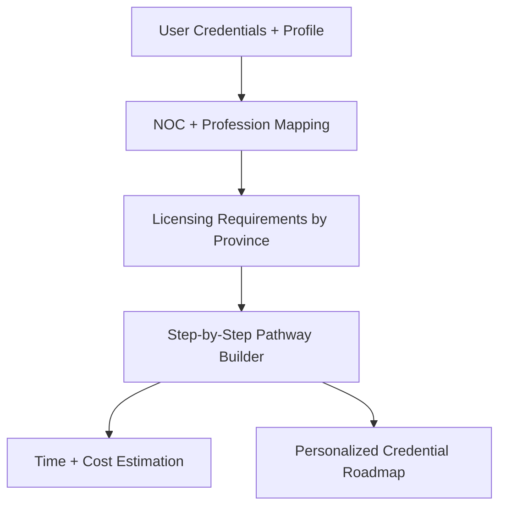

---

## 3) Job Eligibility Graph (Now vs Later)
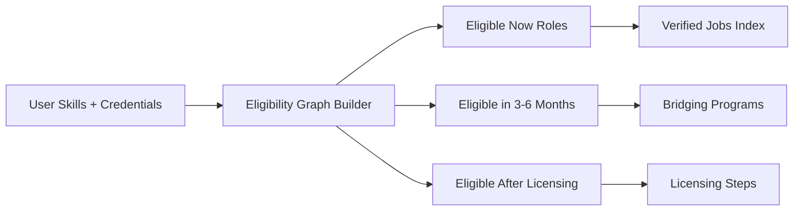

---

## 4) Verified Hiring Marketplace
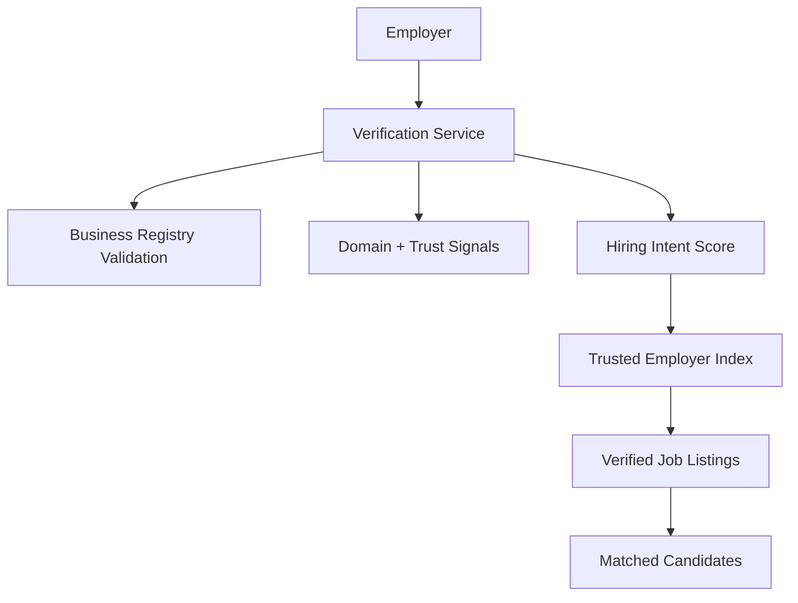

---

## 5) Outcome Accountability Engine
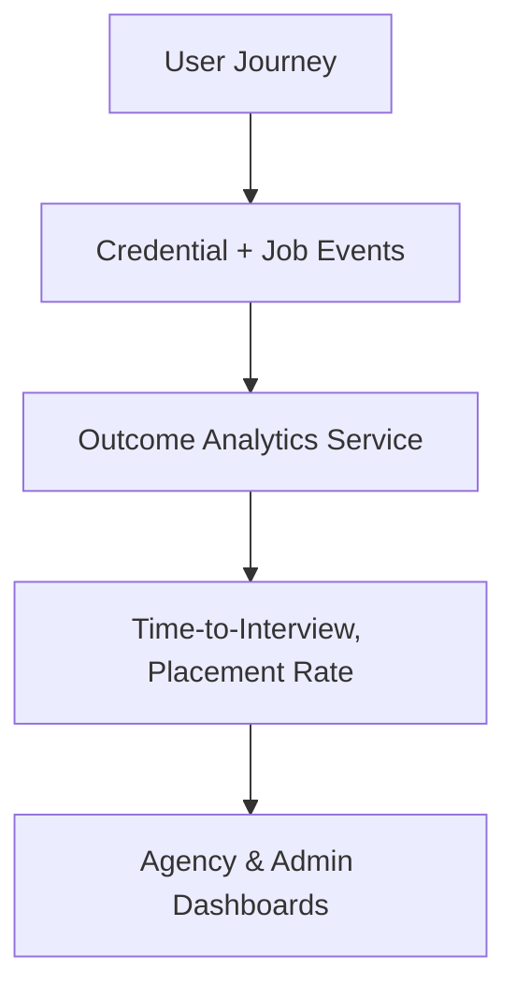

---

## 6) B2B Distribution Flywheel
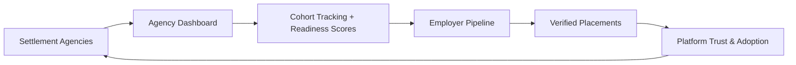
````

If you want, I can now update the **deployment diagrams** and **security architecture diagrams** to match this OS model.

## @OladipoOmotosho

proceed

## Copilot

````markdown name=employment-os-architecture-diagrams.md
# Employment Operating System — Phase 1 Architecture Diagrams

## 1) High-Level System Architecture (OS Model)
```mermaid
flowchart LR
  subgraph Users
    U1[Newcomer (B2C)]
    U2[Agency Advisor (B2B)]
    U3[Employer (B2B)]
  end

  subgraph Frontend
    FE[Web App (Next.js)]
    B2C[B2C Experience]
    B2B[B2B Dashboards]
  end

  subgraph Core Services
    AUTH[Auth Service]
    CORE[Core API]
    PATH[Credential Pathway Service]
    ELIG[Eligibility Graph Service]
    TRUST[Employer Verification Service]
    OUTCOME[Outcome Analytics Service]
  end

  subgraph ML & Intelligence
    NLP[Resume Parsing + Skill Extraction]
    MATCH[Hybrid Matching Engine]
    SCAM[Scam/Fraud Detection]
  end

  subgraph Data Layer
    DB[(PostgreSQL)]
    CACHE[(Redis)]
    SEARCH[(OpenSearch)]
    OBJECT[(Object Storage)]
  end

  U1 --> FE
  U2 --> FE
  U3 --> FE
  FE --> B2C
  FE --> B2B

  B2C --> CORE
  B2B --> CORE
  CORE --> AUTH
  CORE --> PATH
  CORE --> ELIG
  CORE --> TRUST
  CORE --> OUTCOME

  PATH --> DB
  ELIG --> DB
  TRUST --> DB
  OUTCOME --> DB

  NLP --> DB
  MATCH --> SEARCH
  SCAM --> SEARCH

  CORE --> CACHE
  CORE --> SEARCH
  CORE --> OBJECT
```

---

## 2) Credential Pathway Engine (Core Differentiator)
```mermaid
flowchart TD
  USER[User Credentials + Profile] --> MAP[NOC + Profession Mapping]
  MAP --> REQ[Licensing Requirements by Province]
  REQ --> STEP[Step-by-Step Pathway Builder]
  STEP --> TIME[Time + Cost Estimation]
  STEP --> OUTPUT[Personalized Credential Roadmap]
```

---

## 3) Job Eligibility Graph (Now vs Later)
```mermaid
flowchart LR
  PROFILE[User Skills + Credentials] --> ELIG[Eligibility Graph Builder]
  ELIG --> NOW[Eligible Now Roles]
  ELIG --> SOON[Eligible in 3-6 Months]
  ELIG --> LATER[Eligible After Licensing]

  NOW --> JOBS[Verified Jobs Index]
  SOON --> UPSKILL[Bridging Programs]
  LATER --> LIC[Licensing Steps]
```

---

## 4) Verified Hiring Marketplace
```mermaid
flowchart TD
  EMP[Employer] --> VERIFY[Verification Service]
  VERIFY --> REG[Business Registry Validation]
  VERIFY --> DOMAIN[Domain + Trust Signals]
  VERIFY --> SCORE[Hiring Intent Score]
  SCORE --> VERIFIED[Trusted Employer Index]

  VERIFIED --> JOBS[Verified Job Listings]
  JOBS --> USERS[Matched Candidates]
```

---

## 5) Outcome Accountability Engine
```mermaid
flowchart TD
  USER[User Journey] --> EVENTS[Credential + Job Events]
  EVENTS --> OUTCOME[Outcome Analytics Service]
  OUTCOME --> METRICS[Time-to-Interview, Placement Rate]
  METRICS --> DASH[Agency & Admin Dashboards]
```

---

## 6) B2B Distribution Flywheel
```mermaid
flowchart LR
  AGENCIES[Settlement Agencies] --> DASH[Agency Dashboard]
  DASH --> COHORT[Cohort Tracking + Readiness Scores]
  COHORT --> EMPLOYERS[Employer Pipeline]

  EMPLOYERS --> HIRES[Verified Placements]
  HIRES --> TRUST[Platform Trust & Adoption]
  TRUST --> AGENCIES
```
````
