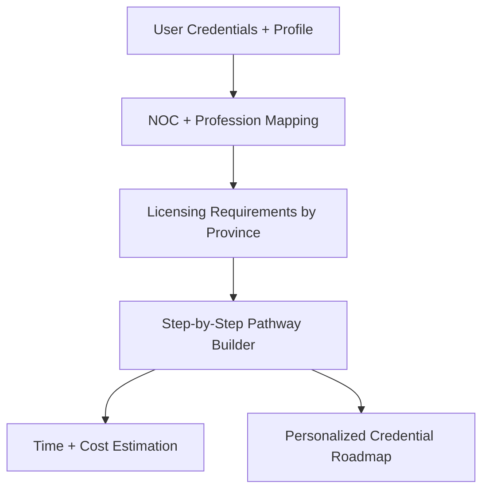
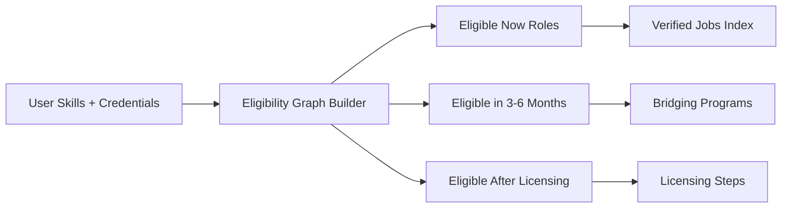
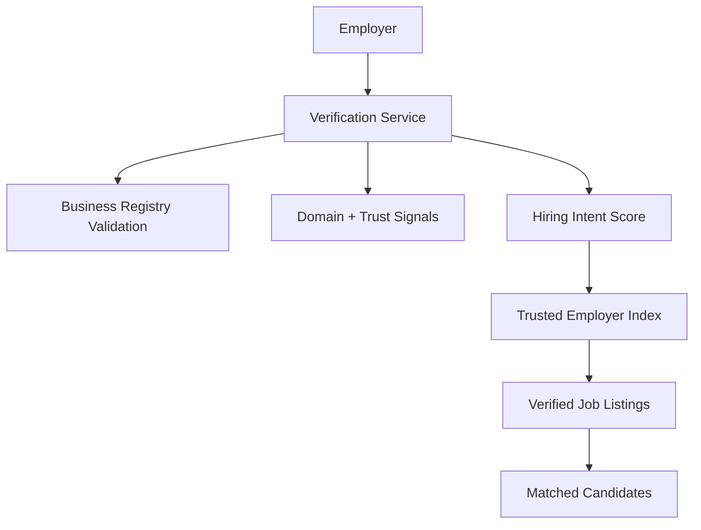
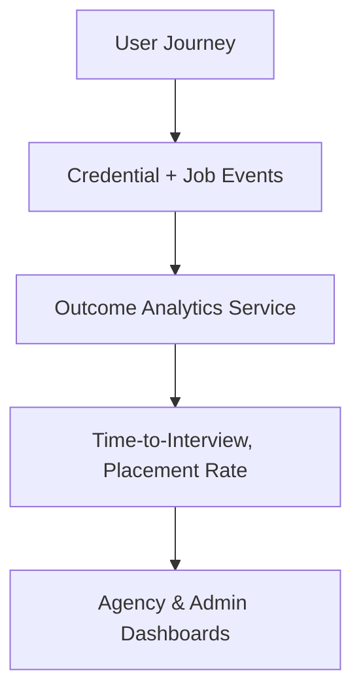
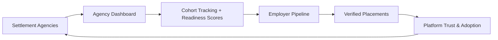

# Employment Operating System — Phase 1 Architecture Diagrams

## 1) High-Level System Architecture (OS Model)
```mermaid
flowchart LR
  subgraph Users
    U1[Newcomer (B2C)]
    U2[Agency Advisor (B2B)]
    U3[Employer (B2B)]
  end

  subgraph Frontend
    FE[Web App (Next.js)]
    B2C[B2C Experience]
    B2B[B2B Dashboards]
  end

  subgraph Core Services
    AUTH[Auth Service]
    CORE[Core API]
    PATH[Credential Pathway Service]
    ELIG[Eligibility Graph Service]
    TRUST[Employer Verification Service]
    OUTCOME[Outcome Analytics Service]
  end

  subgraph ML & Intelligence
    NLP[Resume Parsing + Skill Extraction]
    MATCH[Hybrid Matching Engine]
    SCAM[Scam/Fraud Detection]
  end

  subgraph Data Layer
    DB[(PostgreSQL)]
    CACHE[(Redis)]
    SEARCH[(OpenSearch)]
    OBJECT[(Object Storage)]
  end

  U1 --> FE
  U2 --> FE
  U3 --> FE
  FE --> B2C
  FE --> B2B

  B2C --> CORE
  B2B --> CORE
  CORE --> AUTH
  CORE --> PATH
  CORE --> ELIG
  CORE --> TRUST
  CORE --> OUTCOME

  PATH --> DB
  ELIG --> DB
  TRUST --> DB
  OUTCOME --> DB

  NLP --> DB
  MATCH --> SEARCH
  SCAM --> SEARCH

  CORE --> CACHE
  CORE --> SEARCH
  CORE --> OBJECT
```

---

## 2) Credential Pathway Engine (Core Differentiator)


---

## 3) Job Eligibility Graph (Now vs Later)


---

## 4) Verified Hiring Marketplace


---

## 5) Outcome Accountability Engine


---

## 6) B2B Distribution Flywheel
