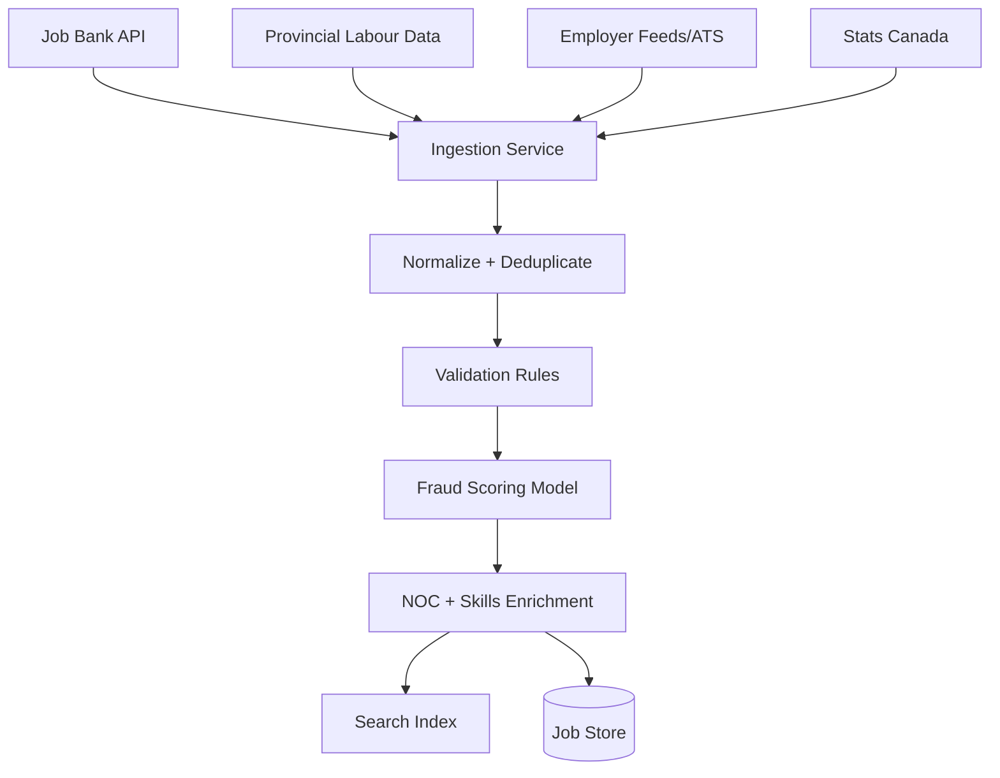
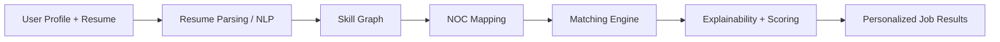
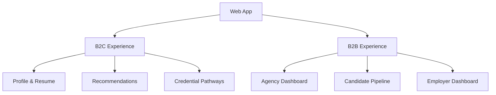

# Phase 1 Architecture Diagrams

## 1) High-Level System Architecture
```mermaid
flowchart LR
  subgraph Users
    U1[Newcomer (B2C)]
    U2[Agency Advisor (B2B)]
    U3[Employer (B2B)]
  end

  subgraph Frontend
    FE[Web App (Next.js)]
  end

  subgraph API Layer
    API[API Gateway]
    AUTH[Auth Service]
    CORE[Core Service]
  end

  subgraph Data Services
    DB[(PostgreSQL)]
    CACHE[(Redis)]
    SEARCH[(OpenSearch)]
    OBJECT[(Object Storage)]
  end

  subgraph ML & Pipelines
    INGEST[Ingestion Pipeline]
    NLP[Resume Parsing & Skill Extraction]
    MATCH[Matching Engine]
    FRAUD[Fraud/Scam Detection]
    AIRFLOW[Airflow Orchestrator]
  end

  U1 --> FE
  U2 --> FE
  U3 --> FE
  FE --> API
  API --> AUTH
  API --> CORE
  CORE --> DB
  CORE --> CACHE
  CORE --> SEARCH
  CORE --> OBJECT

  AIRFLOW --> INGEST
  AIRFLOW --> NLP
  AIRFLOW --> MATCH
  AIRFLOW --> FRAUD
  INGEST --> DB
  NLP --> DB
  MATCH --> SEARCH
  FRAUD --> SEARCH
```

---

## 2) Data Ingestion & Validation Pipeline (Jobs + Market Data)


---

## 3) User Matching & Recommendation Flow


---

## 4) B2C & B2B User Experience Separation


---

## 5) Security & Privacy Architecture
```mermaid
flowchart TD
  USER[User Data]
  USER --> PII[PII Store (Encrypted)]
  USER --> PROFILE[Profile Store]

  PII --> VAULT[Key Management / Vault]
  PROFILE --> ACCESS[Role-Based Access Control]

  ACCESS --> LOGS[Audit Logs]
  ACCESS --> ALERTS[Security Monitoring]

  subgraph Compliance
    PIPEDA[PIPEDA Policies]
    GDPR[GDPR-Ready]
  end

  LOGS --> Compliance
  ALERTS --> Compliance
```