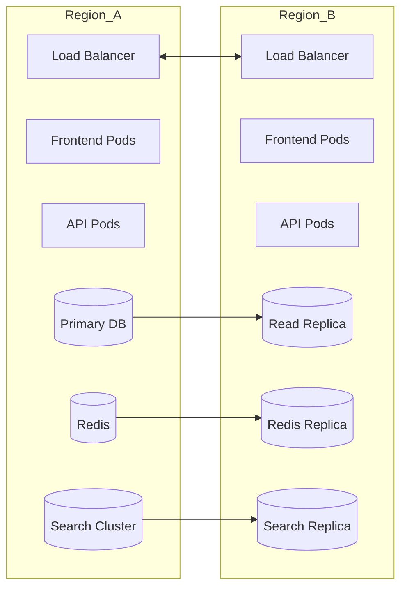
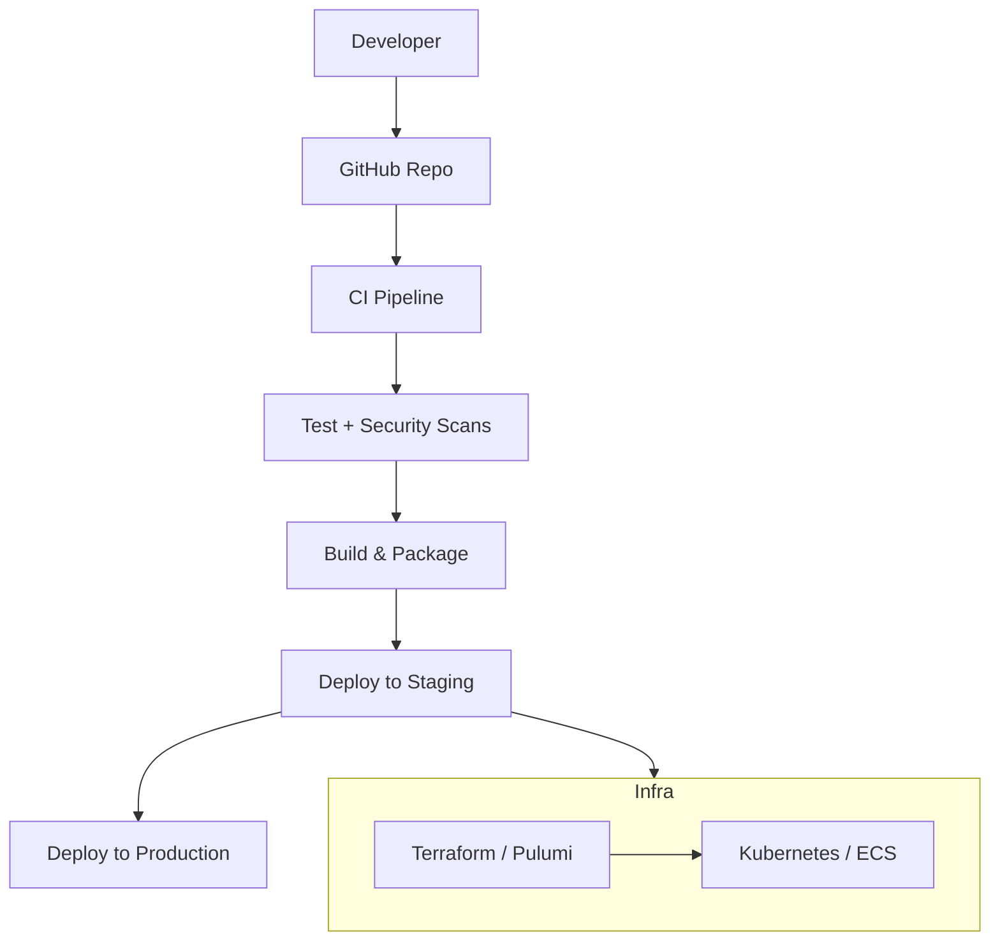

# Phase 1 Deployment & Scaling Diagrams

## 6) Deployment Architecture (Cloud-Neutral)
```mermaid
flowchart TD
  USERS[Users] --> CDN[CDN / Edge Cache]
  CDN --> LB[Load Balancer]

  LB --> FE[Frontend Service (Next.js)]
  LB --> API[API Gateway]

  API --> AUTH[Auth Service]
  API --> CORE[Core API Service]
  API --> MLAPI[ML Service API]

  CORE --> DB[(PostgreSQL)]
  CORE --> CACHE[(Redis)]
  CORE --> SEARCH[(OpenSearch)]
  CORE --> OBJECT[(Object Storage)]

  MLAPI --> QUEUE[Message Queue]
  QUEUE --> WORKERS[Async Workers]
  WORKERS --> DB
  WORKERS --> SEARCH

  subgraph Observability
    LOGS[Centralized Logs]
    METRICS[Metrics/Tracing]
    ALERTS[Alerting]
  end

  FE --> LOGS
  API --> LOGS
  MLAPI --> LOGS
  CORE --> METRICS
  WORKERS --> METRICS
  ALERTS --> CORE
```

---

## 7) Scalability & Failover (Service-Level)


---

## 8) CI/CD & Infrastructure Automation
