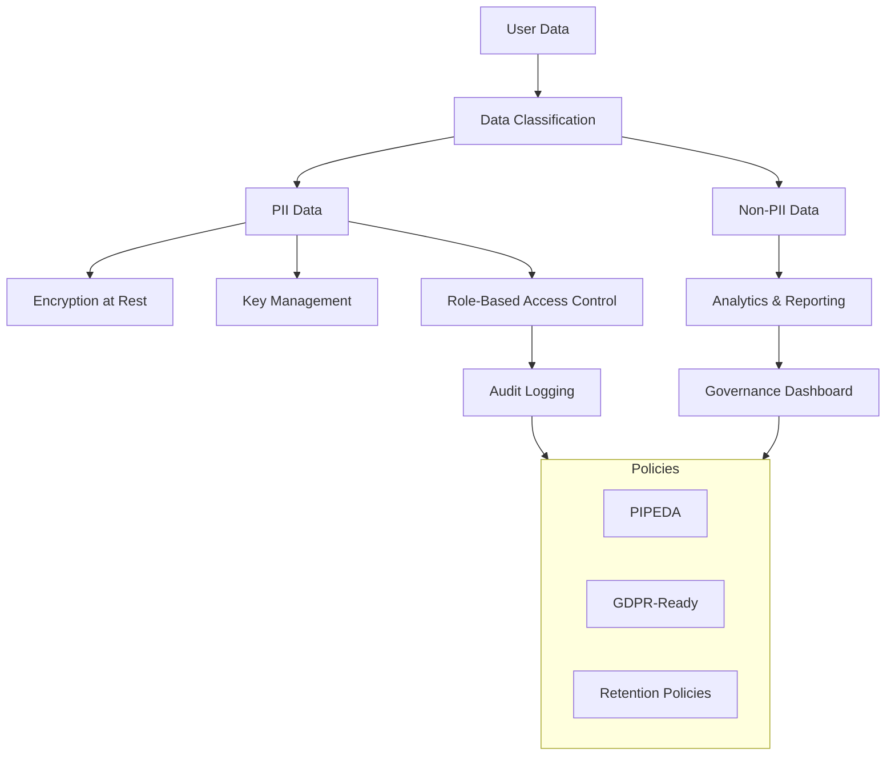
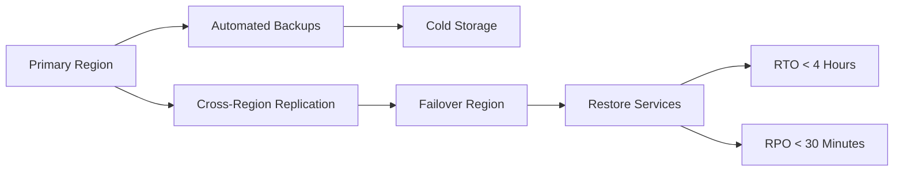
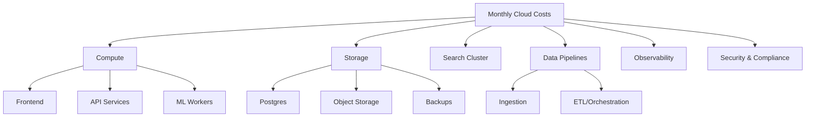

# Phase 1 Data Governance, Disaster Recovery, and Costing Diagrams

## 9) Data Governance & Access Controls

---

## 10) Disaster Recovery & Business Continuity

---

## 11) Costing Model (High-Level)
