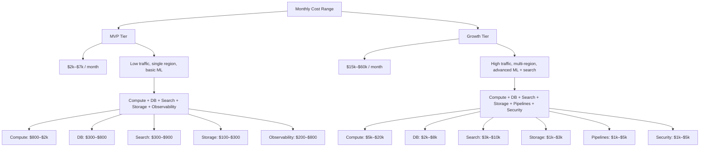

# Phase 1 Privacy-by-Design & Costing (Expanded)

## 12) Privacy-by-Design Data Flow
```mermaid
flowchart TD
  USER[User] --> CONSENT[Consent + Purpose Disclosure]
  CONSENT --> MINIMIZE[Data Minimization]
  MINIMIZE --> SEPARATE[Separate Identity vs Profile Stores]

  SEPARATE --> IDSTORE[Identity Store (Encrypted)]
  SEPARATE --> PROFSTORE[Profile Store (Pseudonymized)]

  PROFSTORE --> ANALYTICS[Analytics (Aggregated)]
  IDSTORE --> ACCESS[Restricted Access]

  ACCESS --> AUDIT[Audit Logs]
  ANALYTICS --> REPORTS[Non-PII Reports]

  subgraph Controls
    RETENTION[Retention Policy]
    DSAR[Data Subject Access Request]
    DELETE[Right to Delete]
  end

  AUDIT --> Controls
  REPORTS --> Controls
```

---

## 13) Costing Model (MVP vs Growth - Rough Estimates)
